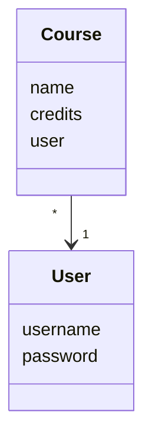

# Arkkitehtuurikuvaus

## Sovelluksen rakenne

Koodin pakkauskaavio:

Pakkaus _ui_ sisältää käyttöliittymästä, _services_ sovelluslogiikasta ja _repositories_ tietojen pysyväistallennuksesta vastaavan koodia. Pakkaus _entities_ sisältää luokat _User_ ja _Course_, jotka kuvastavat sovelluksen käyttämiä tietokohteita.

## Käyttöliittymä

Käyttöliittymä sisältää viisi erilaista näkymää:
- Sisäänkirjautuminen
- Rekisteröityminen
- Kurssinäkymä/etusivu
- Kurssin lisäämisnäkymä
- Kurssin merkitseminen suoritetuksi

Näkymät on toteutettu omina luokkinaan, ja aina korkeintaan yksi näkymistä on kerrallaan auki. [UI](../src/ui/ui.py)-luokka vastaa näkymien välillä siirtymisestä. Käyttöliittymä on erillään sovelluslogiikasta; se ainoastaan kutsuu [AppService](../src/services/service.py)-luokan metoja.

## Sovelluslogiikka

Kaavio sovelluksen loogisesta tietomallista:

Luokka [Course](../src/entities/course.py) kuvaa yksittäisiä kursseja, ja luokka [User](../src/entities/user.py) kuvaa yksittäisiä käyttäjiä.

Toiminnallisista kokonaisuuksista vastaa luokka [AppService](../src/services/service.py). Luokassa on käyttöliittymän jokaiselle toiminnolle oma metodi, kuten esimerkiksi:
- `login(username, password)`, joka kirjaa käyttäjän sisään
- `add_course(name, credit)`, joka lisää uuden kurssin
- `set_course_completed(course, grade)`, joka päivittää annetun kurssin suoritetuksi ja merkitsee siihen annetun arvosanan.

_AppService_-luokka pääsee _repositories_-pakkauksessa sijaitsevien [UserRepository](../src/repositories/user_repository.py)- ja [CourseRepository](..src/repositories/course_repository.py)-luokkien kautta käsiksi käyttäjiin ja kursseihin liittyviin tietoihin.

## Tietojen pysyväistallennus

_Repositories_-pakkauksen _UserRepository_-luokka vastaa käyttäjiin liittyvän tiedon tallentamisesta, ja _CourseRepository_-luokka kursseihin liittyvän tiedon tallentamisesta. Kaikki tieto tallennetaan SQLite-tietokantaan.

### Tietokanta

SQLite-tietokannan tauluun _users_ tallennetaan käyttäjien käyttäjänimi ja salasana. Tietokannassa on lisäksi taulu _courses_, johon tallennetaan kurssien nimi, opintopistemäärä, kurssin lisänneen käyttäjän käyttäjänimi ja arvosana (arvosanan arvo on 0, mikäli kurssi on vielä kesken). Taulut alustetaan tiedostossa [initialize_database.py](../src/initialize_database.py).

## Päätoiminnallisuudet

### Uuden käyttäjän luominen

