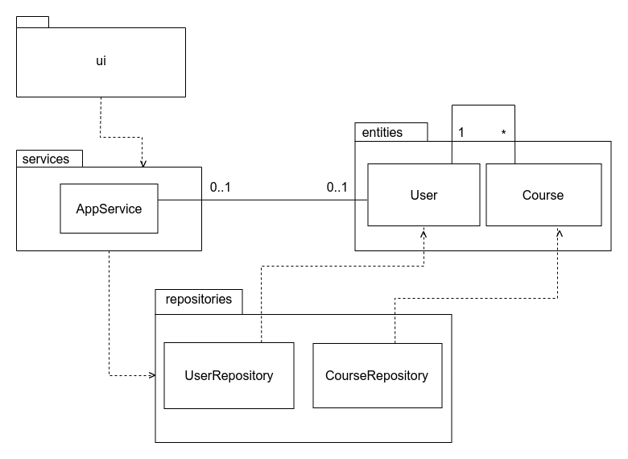

# Arkkitehtuurikuvaus

## Sovelluksen rakenne

Koodin pakkauskaavio:

Pakkaus _ui_ sisältää käyttöliittymästä, _services_ sovelluslogiikasta ja _repositories_ tietojen pysyväistallennuksesta vastaavan koodia. Pakkaus _entities_ sisältää luokat _User_ ja _Course_, jotka kuvastavat sovelluksen käyttämiä tietokohteita.

## Käyttöliittymä

Käyttöliittymä sisältää viisi erilaista näkymää:
- Sisäänkirjautuminen
- Rekisteröityminen
- Kurssinäkymä/etusivu
- Kurssin lisäämisnäkymä
- Kurssin merkitseminen suoritetuksi

Näkymät on toteutettu omina luokkinaan, ja aina korkeintaan yksi näkymistä on kerrallaan auki. [UI](../src/ui/ui.py)-luokka vastaa näkymien välillä siirtymisestä. Käyttöliittymä on erillään sovelluslogiikasta; se ainoastaan kutsuu [AppService](../src/services/service.py)-luokan metoja.

## Sovelluslogiikka

Kaavio sovelluksen loogisesta tietomallista:

Luokka [Course](../src/entities/course.py) kuvaa yksittäisiä kursseja, ja luokka [User](../src/entities/user.py) kuvaa yksittäisiä käyttäjiä.

Toiminnallisista kokonaisuuksista vastaa luokka [AppService](../src/services/service.py). Luokassa on käyttöliittymän jokaiselle toiminnolle oma metodi, kuten esimerkiksi:
- `login(username, password)`, joka kirjaa käyttäjän sisään
- `add_course(name, credit)`, joka lisää uuden kurssin
- `set_course_completed(course, grade)`, joka päivittää annetun kurssin suoritetuksi ja merkitsee siihen annetun arvosanan.

_AppService_-luokka pääsee _repositories_-pakkauksessa sijaitsevien [UserRepository](../src/repositories/user_repository.py)- ja [CourseRepository](..src/repositories/course_repository.py)-luokkien kautta käsiksi käyttäjiin ja kursseihin liittyviin tietoihin.

## Tietojen pysyväistallennus

_Repositories_-pakkauksen _UserRepository_-luokka vastaa käyttäjiin liittyvän tiedon tallentamisesta, ja _CourseRepository_-luokka kursseihin liittyvän tiedon tallentamisesta. Kaikki tieto tallennetaan SQLite-tietokantaan.

### Tietokanta

SQLite-tietokannan tauluun _users_ tallennetaan käyttäjien käyttäjänimi ja salasana. Tietokannassa on lisäksi taulu _courses_, johon tallennetaan kurssien nimi, opintopistemäärä, kurssin lisänneen käyttäjän käyttäjänimi ja arvosana (arvosanan arvo on 0, mikäli kurssi on vielä kesken). Taulut alustetaan tiedostossa [initialize_database.py](../src/initialize_database.py).

## Päätoiminnallisuudet

Ohessa kuvataan sovelluksen päätoiminnallisuuksien etenemistä sekvenssikaavioiden avulla.

### Uuden käyttäjän luominen

Sovelluksen kontrolli etenee seuraavalla tavalla, kun käyttäjän syöttämät tunnukset ovat kelvolliset eli sekä käyttäjänimi että salasana ovat 4-10 merkin pituisia ja käyttäjänimi ei ole vielä käytössä.

Kun käyttäjä painaa painiketta "Luo käyttäjä", tapahtumakäsittelijä kutsuu metodia create_user parametreina käyttäjän käyttäjänimi ja salasana. Käyttäjärepositorion avulla selvitetään, onko annettu käyttäjätunnus jo olemassa. Jos ei, niin uusi käyttäjä on mahdollista luoda ja luodaankin olio `User`, jonka tiedot tallennetaan tietokantaan. Käyttäjä kirjataan sitten sisään ja näkymäksi vaihdetaan `LoginView`, josta käyttäjä pääsee kirjautumaan juuri luomillaan tunnuksilla sisään.

### Sisäänkirjautuminen

Sovelluksen tapahtumat etenevät seuraavalla tavalla, kun käyttäjän syöttämät tunnukset täsmäävät.

Kun käyttäjä painaa painiketta "Kirjaudu sisään", tapahtumankäsittelijä kutsuu metodia login parametreinaan käyttäjän käyttäjänimi ja salasana, minkä jälkeen tarkistetaan UserRepositoryn avulla, onko käyttäjää olemassa. Jos käyttäjä on olemassa ja salasana täsmää, niin näkymäksi vaihdetaan `FrontPageView` eli etusivu/kurssinäkymä.

### Kurssin lisääminen

Sovelluksen tapahtumat etenevät seuraavalla tavalla, kun käyttäjä haluaa lisätä uuden kurssin.

Kun käyttäjä painaa painiketta "Lisää kurssi", tapahtumankäsittelijä kutsuu metodia `add_course` parametreinaan kurssin nimi ja siitä saatavien opintopisteiden määrä. `AppService` lähettää tiedon eteenpäin kurssirepositoriolle kutsumalla sen metodia add course, jolla on parametrinä `Course`-olio, jolla on tietoina kurssin nimi, opintopisteiden määrä, arvosana (0, kun kurssi ei ole vielä suoritettu) ja käyttäjänimi. Kurssi on lisätty onnistuneesti, jos samannimistä kurssia ei ole vielä olemassa tietokannassa. Tämän jälkeen näkymäksi vaihtuu `FrontPageView`.

### Kurssin merkitseminen suoritetuksi

Sovelluksen tapahtumat etenevät seuraavalla tavalla, kun käyttäjä haluaa merkitä kurssin suoritetuksi.

Kun käyttäjä on syöttänyt kurssille arvosanaksi numeron väliltä 1-5 ja painanut nappia "Merkitse suoritetuksi", tapahtumankäsittelijä kutsuu metodia `set_course_done`, jolla on parametreinä kurssin nimi ja käyttäjän syöttämä arvosana. `AppService` kutsuu kurssirepositorion metodia `set_course_completed` samoilla parametreilla ja tietokantaan tallennetaan kurssille uusi arvosana. `AppService` kutsuu myös kurssirepositorion metodia `set_current_course`, joka vaihtaa repositorion "current course" arvoksi None, eli sillä hetkellä ei käsitellä enää mitään tiettyä kurssia. Tämän jälkeen käyttäjä palaa automaattisesti sovelluksen etusivulle.

