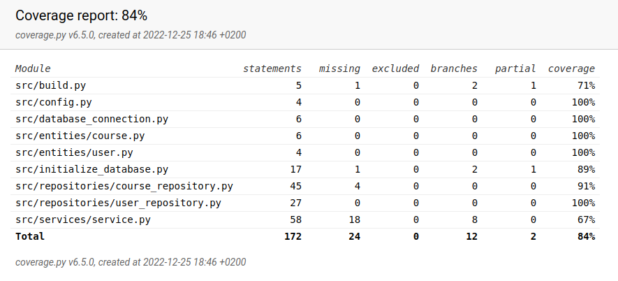

# Testausdokumentti

Ohjelmaa on testattu automaattisilla unittestin yksikkö ja integraatiotesteillä ja manuaalisesti järjestelmätason testeillä.

## Yksikkö- ja integraatiotestaus

### Repositorio-luokat

Repositorio-luokkia `UserRepository` ja `CourseRepository` on testattu ainoastaan testitietokannoilla. `UserRepository`-luokkaa testataan [TestUserRepository](../src/tests/repositories/user_repository_test.py)-testiluokalla, ja `CourseRepository`-luokkaa [TestCourseRepository](../src/tests/repositories/course_repository_test.py)-testiluokalla.

### Sovelluslogiikka

Sovelluslogiikasta vastaavaa luokkaa `AppService` testataan [TestAppService](..src/tests/services/service_test.py)-testiluokalla. `AppService`-oliolle injektoidaan riippuvuuksiksi repositorio-oliot `FakeUserRepository` ja `FakeCourseRepository`, jotka tallentavat tietoa muistiin pysyväistallennuksen sijaan.

### Testikattavuus

Sovelluksen testauksen haarautumakattavuus on 84%, kun käyttöliittymän jätettiin testauksen ulkopuolelle.

Testaamatta jäivät osa [AppService](../src/services/service.py)-luokan metodeista, kuten tietyn käyttäjän suorittamien ja kesken olevien kurssien hakeminen, kurssin merkitseminen suoritetuksi ja kurssin poistaminen. 

## Järjestelmätestaus

Ohjelman järjestelmätehtaus on suoritettu manuaalisesti.

### Asennus ja konfigurointi

Sovellusta on testattu [käyttöohjeessa](./kayttoohje.md) esitetyllä tavalla Linux-ympäristössä.

### Toiminnallisuudet

Sekä käyttöohjeessa että [määrittelydokumentissa](./vaatimusmaarittely.md) olevat toiminnallisuudet on kaikki testattu. Toiminnallisuuksia testatessa on myös kokeiltu virheellisiä syötteitä, kuten tyhjiä syötteitä ja vääriä käyttäjänimiä.

